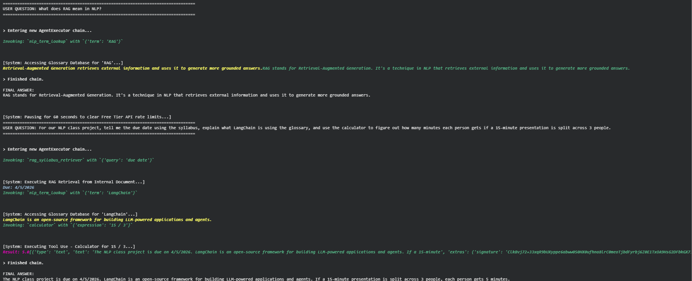

# Autonomous LangChain Agent with RAG 🤖

[](https://www.python.org/)
[](https://python.langchain.com/)
[](https://aistudio.google.com/)

**CAP6640 – Natural Language Processing | Florida Atlantic University**

---

## 📌 Overview

This project demonstrates the design and implementation of an **autonomous AI agent** built with LangChain. Rather than relying on static, pre-scripted responses, the agent dynamically **reasons, selects tools, and retrieves external knowledge** to answer complex, multi-step queries.

At its core, the system integrates a **Retrieval-Augmented Generation (RAG)** pipeline, enabling interaction with private documents while producing accurate, grounded outputs — with no hallucinations.

🎥 **[Watch the Live Demo](https://youtu.be/CahLVW8_Bbk)**

---

## 🧠 Key Features

- Autonomous **tool selection via ReAct-style reasoning**
- **RAG pipeline** for querying private documents (course syllabus)
- Real-time **math execution** via a sandboxed Python tool
- Internal **NLP glossary** for concept lookups
- Full reasoning transparency via **LangChain verbose traces**

---

## 🛠️ Tech Stack

| Component | Details |
|---|---|
| **Framework** | LangChain (AgentExecutor, Tool Calling) |
| **LLM** | Google Gemini 2.5 Flash |
| **Environment** | Python 3.12 · Google Colab |
| **Concepts** | ReAct Prompting · Tool Binding · RAG |

---

## 🧰 Agent Tools

### 1. 📄 RAG Document Retriever
Extracts grounded information from a private document (course syllabus). Ensures responses are context-aware and factually anchored rather than hallucinated.

### 2. 📚 NLP Glossary
An internal dictionary for defining key NLP concepts. Supports educational and technical queries without requiring external lookups.

### 3. 🧮 Python Calculator
Safely evaluates arithmetic expressions, enabling multi-step reasoning with precise numerical outputs.

---

## 🔄 Agent Reasoning Loop

The agent follows an iterative **Thought → Action → Observation → Answer** cycle:

1. **Thought** — Interprets the user's intent
2. **Action** — Selects and invokes the appropriate tool
3. **Observation** — Processes the tool's output
4. **Final Answer** — Synthesizes a complete, grounded response

This loop is powered by **LangChain's ReAct-style agent architecture**, enabling the system to handle complex, multi-part prompts in a single pass.

---

## 💻 Getting Started

### 1. Clone the Repository
```bash
git clone https://github.com/your-username/your-repo-name.git
cd your-repo-name
```

### 2. Install Dependencies
```bash
pip install -U langchain langchain-google-genai langchain-classic
```

### 3. Add Your API Key
Set your Google Gemini API key as an environment variable:
```bash
export GOOGLE_API_KEY=your_api_key_here
```

### 4. Run the Agent
Execute the main script or open the Colab notebook to begin interacting with the agent.

---

## 📊 Example Use Case

**Prompt:**
> *"What is overfitting, what does the syllabus say about the midterm, and what is 25 × 17?"*

**Agent Behavior:**
1. Queries the **NLP Glossary** → defines overfitting
2. Uses the **RAG Retriever** → pulls relevant syllabus content
3. Calls the **Python Calculator** → computes `25 × 17 = 425`
4. Combines all results into a single, coherent final answer

---

## 📸 Example Output

Add a screenshot of your agent trace here (Thought → Action → Observation → Final Answer):

```

```

---

## 🤝 Team

| Name | Role |
|---|---|
| **Noah Russell** | Lead Engineer — Agent Architecture & Implementation |
| **Alejandro Guerra** | NLP Research & Documentation |
| **Jesse McDonald** | Presentation & Demo Development |

---

## 📌 Notes

This project was developed as part of a graduate-level NLP course at Florida Atlantic University and demonstrates:
- Practical autonomous agent design
- Tool-augmented LLM reasoning
- Real-world AI system integration using modern frameworks

---

## 🔥 Potential Enhancements

- Add an **architecture diagram** illustrating the agent's reasoning pipeline
- Include a direct **Colab notebook link** for one-click access
- Expand **sample outputs** with full reasoning traces
- Incorporate **evaluation metrics** or performance benchmarks
